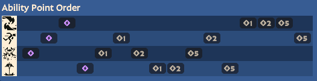

# Abrams

### Abilities
1. AoE Lifesteal (Siphon Life)
   1. lower CD
   2. more duration
   3. more DPS
2. Melee Dash (Shoulder Charge)
   1. lower CD
   2. go further, i.e. more duration
   3. more weapon dmg post enemy hit
3. Passive Regen ~20% of Incoming Damage (Infernal Resilience)
   1. more health regen
   2. more base health
   3. more incoming dmg regenerated
4. Jump > Hover > Smash AoE Stun (Siesmic Impact)
   1. lower CD
   2. more max HP and fire rate per enemy hit
   3. on cast
      1. immune to
         1. Stun, Silence, Sleep, Root, Disarm
      2. i.e. susceptible to
         1. Tether, Slow, Knockback, Displacement, Item-Based CC

### Skill Priority
Remember, we unlock 2nd skill at 400 souls, 3rd at 1.5k, with ult at 3k.
- Safe
  - Regen > Charge
- Aggro
  - Charge > Regen

  

Abrams bait-and-switches enemies with lifesteal, and starts fights with charge. Most ability upgrades to lower CD do so significantly! This is why we jump around to grab lower CDs rather than max one skill at a time.
1. More Regen
2. -20s CD on Charge
3. 150 Base HP
4. -40s CD on Ult

Note that we do level up Regen twice before our ult for the 150 base health (effectively worth 468.75 souls gained instantly, plus time saved not going to the shop).

### Combos
- When charging, time pressing Q for melee exactly (or just barely after) impact for maximum burst.
- **Charge > Lifesteal > Melee**
  - The late activation of Siphon Life ensures you're in range.

### Tactics
- ***Hitting enemies against walls is essential.***
  - Narrow alleys in the jungle are perfect.
- ***Passive regen takes place over 18s***, deferring a portion of that incoming damage.
  - ***When it's a close fight, hiding for a little can give you a big advantage over your wounded opponent.***
- ***You can activate Lifesteal at any time***
  - This includes *during* other ability animations.
- ***Cover huge distances with dash-jumps and your ult for suprise ganks.***
  - Consider pairing this with the Majestic Leap item for an epic combo.

### Gun Style
- Slow shotgun with ADS.