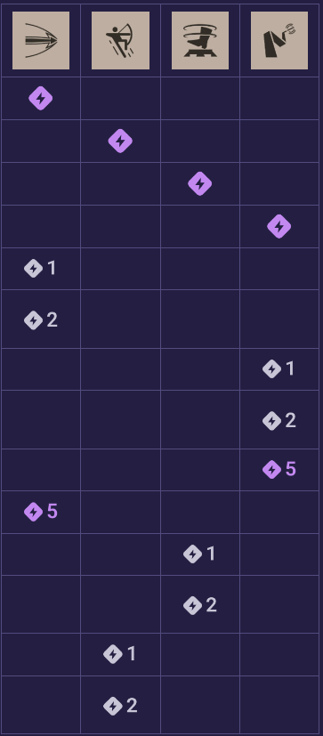

# Grey Talon

### Abilities
1. Snipe (Charged Shot)
   1. +1 charge
   2. more dmg
   3. more dmg, less charge delay
2. Jump (Rain of Arrows)
   1. less CD
   2. more dmg, applies slow to enemies
   3. adds lifesteal
3. Trap (Immobilizing Trap)
   1. less cd
   2. longer immobilize duration
   3. more bullet dmg to enemies hit by trap
4. Owl (Guided Owl)
   1. more dmg
   2. less CD
   3. kills enemies below 22% on hit

### Skill Priority

  

- Snipe is our main poking ability, so getting another charge and some damage early is key.
- All the upgrades to Owl are insane. +100 damage *then* -50s CD? And on top of that, a 22% health or lower instakill? Max ASAP after lane phase.
- Finish Snipe, then increase hard CC first (two points in trap for immobilize) with soft CC after (two points in Jump for bullet slow).

### Combos
- **Jump > Owl**
- **Jump > Charged Melee**

### Tactics
- ***The hitbox of Snipe is larger than expected.***
  - You can still hit enemies behind thin or shallow cover.
- ***Use charged melee attack (Q) while floating to maneuver quicker.***
- ***Place traps where an enemy is going to be, not where they are.***
  - Remember, there is a 2s windup time before the trap arms.
- ***Cast Owl to get up high then dive.***
  - This is much easier than weaving at street level.
- ***Owl stuns!***
  - You can interrupt Seven (sphere AoE) or Bebop (hyperbeam)!

### Gun Style
- single-shot bow with ADS

### Core Items
- **Early**
   - High-Velocity Mag > Headshot Booster > Long Range
- **Mid**
   - Quicksilver Reload > Headhunter > Burst Fire
- **Late**
   - Superior Cooldown > Sharpshooter > Lucky Shot
- **Late-Late**
  -  Boundless Spirit > Vampiric Burst > Ricochet