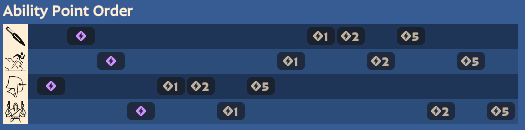

# Haze

### Abilities
1. Dagger (Sleep Dagger)
   1. removes 1 enemy stamina
   2. -12s CD
   3. -12% bullet resist to target
2. Invis (Smoke Bomb)
   1. -14s CD
   2. +6m/s invis speed
   3. Stim upon breaking invis
3. DPS (Fixation)
   1. spirit dmg + slow
   2. more dmg, more slow
   3. +0.2 wpn dmg per stacking hit
4. Bullet Dance
   1. +7 weapon dmg
   2. -38s CD
   3. +1 target hit per shot
### Skill Priority

  

- Fixation is the main damage dealer, so we grab 2 points early. 1 point in Ult to maximize dps, then back to Fixation.
- Get the instant sprint speed for Smoke Bomb, then two points in Dagger to increase kill potential.

### Combos
- Smoke Bomb > Dagger > LMB
- Dagger > Ult > Smoke Bomb
- LMB > Dagger (with Quicksilver Reload) > LMB > Kinetic Dash (chasing) > LMB
  - Get 2 free clips with these items!

### Tactics
- Throwing a Dagger does not interrupt invisibility.
- Dagger does not interrupt channeling enemies.
- Sleeping targets wake up shortly after being damaged.
- While invisible, attacking removes it.
- Enemies close by can see a translucent form of you!
- Keep in mind that Smoke Bomb invis is your only form of escape!
- Play mind games.  For example, establish a pattern of going back to buy, but then set up an ambush instead.

### Gun Style
- Dual-wield uzis with ADS, high base AS

### Core Items
- Use **Chrome's Rapid Haze**
