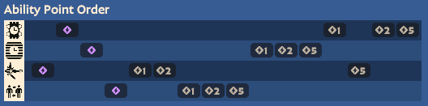

# Paradox

### Abilities
1. **Grenade** (Pulse Grenade)
   1. +1 pulses
   2. less CD
   3. more dmg
2. **Wall** (Time Wall)
   1. bigger
   2. +1 charge
   3. silences enemies
3. **Snipe** (Kinetic Carbine)
   1. longer stop duration
   2. less CD, longer speed boost duration
   3. more dmg
4. **Swap** (Paradoxical Swap)
   1. more cast range
   2. more dmg
   3. less CD

### Skill Priority

  

Two points in Snipe early helps poking in lane.

### Combos
- **Snipe Charge > Grenade  > Click**
  - Use Pulse Grenade's slow and damage amp to set up an easier-to-hit and boosted-dmg Snipe poke.
- **Snipe Charge > Ult > Click**
  - Good for dueling, setting up an easy hit, saving Wall and Grenade for utility.
- **Snipe Charge > Ult > Wall > Click**
  - This is a more advanced teamfight engage.
  - We can spam 2 (Wall) and left-click near the end to ensure everything gets off as a burst.

### Tactics
- ***Snipe while reloading to increase efficiency!***
  - You can't fire if you have a completely empty clip though.
- ***Pulse Grenade sticks to walls and ceilings!***
- ***Don't forget that activating Snipe increases movespeed!***
- ***If retreating, don't turn to face enemies to use Wall!***
  - ***Place it in front of you*** then run through.
- You can set up a Pulse Grenade underneath your feet, then ult an enemy to swap them into it.
- Pulse Grenade is a sphere that can penetrate cover to hit enemies.
- You can stop yourself in the air multiple times with while Snipe is charging to mix up movement.
- Use CC from Grenade, Wall, and Snipe to set up Swap in creative ways.

### Gun Style
- 5-shot burst uzi with ADS