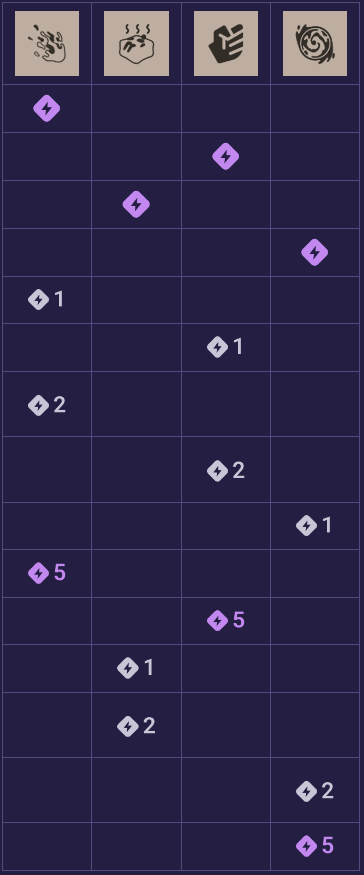

# Viscous

### Abilities
1. Grenade (Splatter)
   1. less CD
   2. more dmg, area
   3. bounces twice (leaving 3 AoE splashes)
2. Cube (The Cube)
   1. more movespeed, stamina recovery
   2. less CD
   3. more regen
3. Punch (Puddle Punch)
   1. +1 charge
   2. more dmg, movement slow
   3. less CD
4. Ball (Goo Ball)
   1. more duration
   2. more dmg
   3. can cast abilities while rolling
### Skill Priority

  

- We want to quickly grab one point in Grenade and Punch to spam the Grenade > Punch combo.
- Then grab another 1-1 split to increase the Grenade > Punch combo.
- Then do it again, upgrade Grenade, then Punch, emphasizing the combo.
- Get two points in Cube for teamfights so its off CD more often.
- Max Ball last since we'll usually cast abilities before going Ball-mode, and the stun is emphasized rather than dmg.

### Combos
- **Punch > Grenade**
  - *Aim a bit higher* to account for the knockup unless in close range.
- **Dash-Jump > Ult > Left Click > Double Jump**
  - Chase down an enemy.
- **Dash > Cube > MB3**
  - Get forward momentum before cubing to slide to safety.

### Tactics
- ***Melee items interact with Punch!***
- ***Punch can come out of walls or cielings.***
- ***Cast Cube on channeling allies to protect them w/o interrupting them (e.g. Seven or McGinnis).***
- ***Ball's double jump doesn't consume stamina!***
- Cube keeps the target's momentum.
- Use Grenade to poke.
- Use Grenade's AoE residue to cut off retreat paths.

### Gun Style
- heavy single shot AR with goo grenade (no ADS)
- ***Goo grenade does a LOT more damage that single bullets.***

### Core Items
- Remember, ***Melee items interact with Punch!***

- **Early**
   - Extra Charge > Melee Lifesteal > Spirit Strike
- **Mid**
   - Improved CD (Grenade) > Lifestrike > Slowing Bullets
   - Improved Burst > Improved Spirit (sell Spirit Strike)
- **Late**
   - Improved Reach > Superior CD > Boundless Spirit
