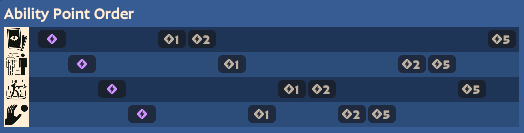

# Wraith

### Abilities
1. Homing Card (Card Trick)
   1. +1 card
   2. more dmg
   3. less cooldown
2. Teleport (Project Mind)
   1. extended range
   2. grants shield for 8s
   3. less cooldown
3. Stim Pack (Full Auto)
   1. less cooldown
   2. adds spirit damage
   3. adds lifesteal
4. Hand (Telekinesis)
   1. less cooldown
   2. longer duration
   3. becomes AoE
### Skill Priority

  

- We always start with card, as it's our main poke.
- After upgrading card to full burst, we grab extended range on teleport to become a slippery split pusher.

### Combos
- **Continuously Fire > Card > Continuously Fire**
- **Continuously Fire > Stim w/ Quicksilver Reload**

### Tactics
- ***Use Card's splash damage*** to hit enemies behind cover or thin walls.
- ***Splitpushing is a good idea***, but always have an escape plan (e.g. Teleport).
- ***Teleport can go anywhere within a sphere.***
  - You can even teleport to a place that is simply mid-air.
  - This is useful for unpredictable movement as well as chasing.
- ***Stim helps trooper waves and teammates too***.
- ***Telekinesis can get countered***, so be mindful of enemies with skills that can dodge it (e.g. Mo and Krill) or items that deny it (e.g. Ethereal Shift).
- ***Assign Quicksilver Reload to Stim*** so that any time an activation is needed, you have a full clip.
  - This is useful for surprise skirmishes as well as stepping forward to hit objectives when a timing window opens up.

### Gun Style
- machine gun w ADS

### Core Items
- **Lane**
   - Basic Mag > Monster Rounds > Mystic Reach
   - Extra Regen > Healing Rite > Slowing Bullets
- **Core**
   - Quicksilver Reload > Tesla Bullets > Lucky Shot
- **Situational**
   - Titanic Magazine > Toxic Bullets > Healbane
   - Bullet/Spirit Armor > Improved B/S Armor
- **Late**
  - Glass Cannon > Vampiric Burst > Leech
  - Inhibitor > Curse > Improved Reach
